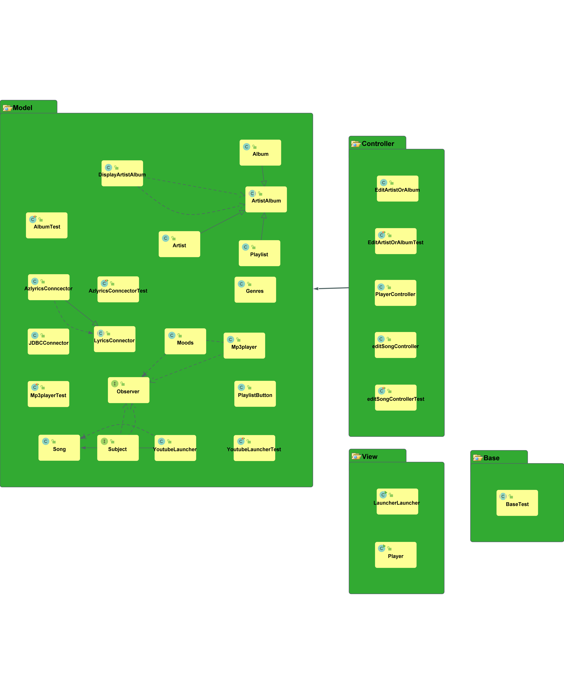

## Evaluación de Arquitectura y atributos (QAW + ATAM) 🏬

### Propósito 🔎

_**ATAM**_ es un método altamente estructurado para evaluar un diseño de arquitectura el cuál permite detectar, de manera temprana, riesgos técnicos, conflictos entre atributos, puntos sensitivos del diseño y soluciones.

_**QAW**_ (Quality Attribute Workshops) por su parte proporciona un método para la determinación de un sistema crítico basado   en   el análisis   de   los   atributos   de   calidad,   al   igual   que disponibilidad,  rendimiento,  seguridad,  interoperabilidad  y  modificabilidad.  En  este  orden, QAW  complementa  la  arquitectura  _**ATAM**_,  puesto  que  identifica  los  atributos  relevantes  de calidad   y   permite   establecer   los   requisitos   del   sistema   antes de la existencia de una arquitectura de software.
**(M.  R.  Barbacci,  R.  Ellison,  A.  J.  Lattanze,  J.  Stafford,  C.  Weinstock  y  W.  Wood,  Quality Attribute   Workshops   (QAWs),   Third   Edition   (CMU/SEI-2003-TR-016,   ADA418428)   ed., Pittsburgh, PA: Software Engineering Institute, Carnegie Mellon University, 2003.)**

En este análisis se presentará una primera aproximación a la documentación arquitectónica de esta solución, así cómo una evaluación inicial a sus atributos claves de negocio (Drivers) cómo input inicial a las operaciones y mantenimiento de arquitectura futuros de la misma. 

### Presentación de la arquitectura 🔨

La documentación mediante vistas es una forma de documentar el diseño de arquitectura considerando los intereses de los interesados en el producto. Existen variadas maneras de expresar las vistas y sus interrelaciones, en esta oporunidad y considerando el alcance del producto, se presentarán las vistas de componentes combinado con una vista a las interacciones a alto nivel entre los mismos. 

Algunas de estas vistas se generaron utilizando la herramienta  [Code Iris](https://plugins.jetbrains.com/plugin/7324-code-iris) para IntelliJ. 

### Vista de Interacción 🔄

### Vista de Paquetes y uso 🗂

### Vista de Dependencias 🔗

### Evaluación de atributos de calidad ✅

|       Elemento de trabajo       |                                                                         Detalle                                                                          |
|:-------------------------------:|:--------------------------------------------------------------------------------------------------------------------------------------------------------:|
|            Escenario            |                La completitud de la reproducción de una canción, la adición de un album y de una lista deberían tomar menos de 5 minutos                 |
|       Objetivo de Negocio       |                                                       Un reproductor de música  atractivo y usable                                                       |
| Atributos de calidad relevantes |                                                                        Usabilidad                                                                        |
|            Estimulo             |                                Los usuarios reproducen una canción, navegan por los menús y hacen listas de reproducción                                 |
|       Fuente del estimulo       |                                                        Un usuario en la aplicación de escritorio                                                         |
|            Ambiente             |                          La aplicación de escritorio ha sido iniciada y los sistemas de almacenamiento se encuentran en línea.                           |
|            Artefacto            |                                                                 Aplicación de escritorio                                                                 |
|            Respuesta            |                                  Las actividades de los usuarios se completan satisfactoriamente en el tiempo requerido                                  |
|     Medida de la respuesta      |                                                     [ (Σ tiempo de la tarea ) / # de tareas) ] <  5m                                                     |
|            Preguntas            |        ¿Qué sucede en la GUI cuando la canción cargada toma mucho tiempo de almacenamiento o la cantidad de listas de reproducción es muy grande?        |
|         Inconvenientes          | Los usuarios deben estar capacitados para usar la aplicación correctamente y actualmente el sistema no cuenta con tutoriales interactivos o guías de uso |

### Escenario #2

|       Elemento de trabajo       |                                                  Detalle                                                  |
|:-------------------------------:|:---------------------------------------------------------------------------------------------------------:|
|            Escenario            |               El reproductor de audio se distribuirá a lo largo del mundo / Publico general               |
|       Objetivo de Negocio       |                              Un reproductor de música  disponible para todos                              |
| Atributos de calidad relevantes |                                           Internacionalización                                            |
|            Estimulo             |                  La GUI responde al idioma del sistema en el que se encuentre instalado                   |
|       Fuente del estimulo       |                                 Un usuario en la aplicación de escritorio                                 |
|            Ambiente             |   La aplicación de escritorio ha sido iniciada y los sistemas de almacenamiento se encuentran en línea.   |
|            Artefacto            |                                         Aplicación de escritorio                                          |
|            Respuesta            |                Los usuarios pueden entender el contenido de la UI en su idioma de sistema                 |
|     Medida de la respuesta      |      [ (Σ idiomas de las regiones de uso  ) / # de paises en donde se usa el reproductor) ] >= 0.90       |
|            Preguntas            | ¿Se pretenden utilizar lenguajes de uso general o lenguajes de minorias étnicas / inclusión de dialectos? |
|         Inconvenientes          |                                                                                                           |

### Escenario #3

|       Elemento de trabajo       |                                                         Detalle                                                          |
|:-------------------------------:|:------------------------------------------------------------------------------------------------------------------------:|
|            Escenario            |                Se requiere que el reproductor pueda ser usado en las diferentes plataformas Windows e IOS                |
|       Objetivo de Negocio       |                                     Un reproductor de música  disponible para todos                                      |
| Atributos de calidad relevantes |                                                    Interoperabilidad                                                     |
|            Estimulo             |    Los usuarios pueden usar el sistema en los diferentes dispositivos/plataformas con una funcionalidad mayor al 90%     |
|       Fuente del estimulo       |                                        Un usuario en la aplicación de escritorio                                         |
|            Ambiente             |         La aplicación de escritorio no ha sido iniciada y los sistemas de almacenamiento se encuentran en línea.         |
|            Artefacto            |                                                 Aplicación de escritorio                                                 |
|            Respuesta            | La aplicación se inicializa de forma correcta y permite realizar las actividades a los usuarios en distintas plataformas |
|     Medida de la respuesta      |              [ (Σ funcionalides éxitosas en la plataforma en uso ) / # de funcionalidades totales) ] > 0.80              |
|            Preguntas            |                           ¿Que sucede con las plataformas móviles o los OS de uso no general?                            |
|         Inconvenientes          |                                                                                                                          |
