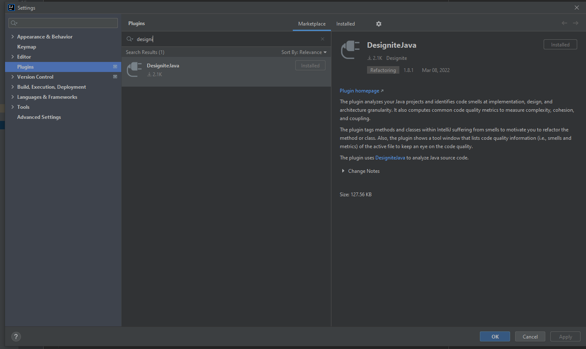
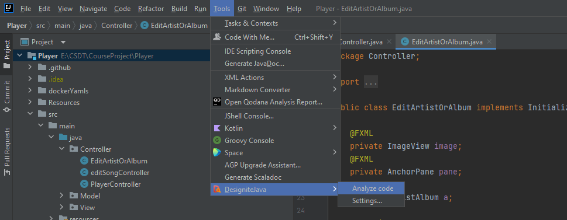
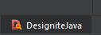
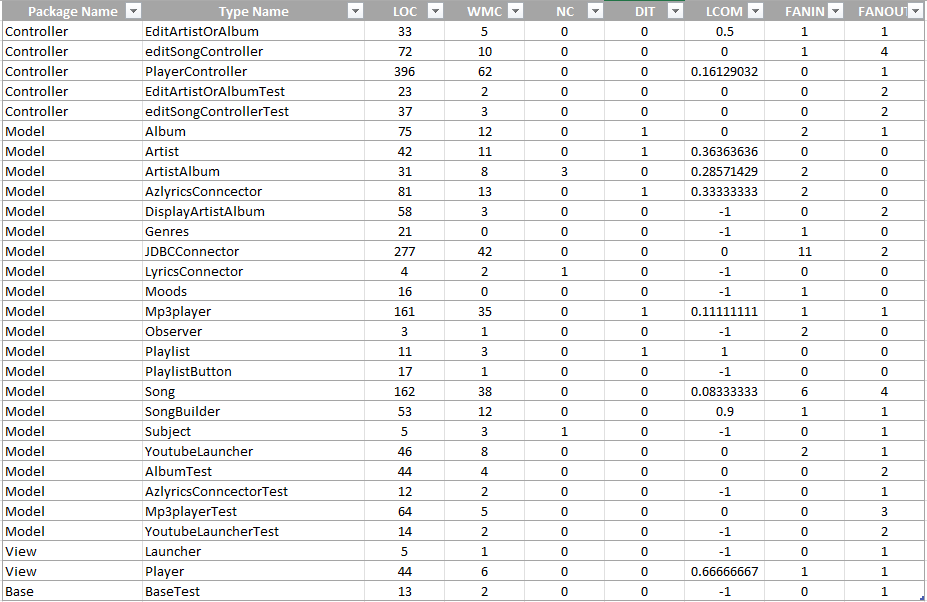
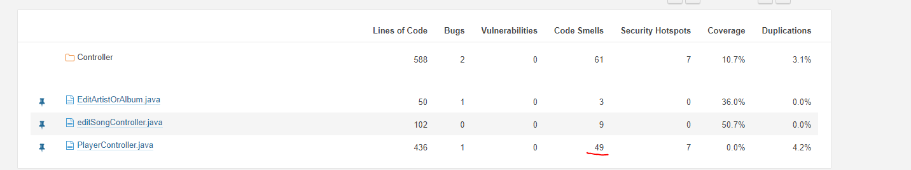
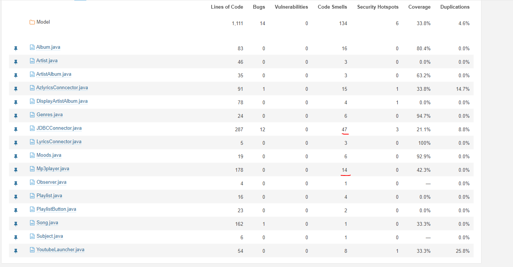
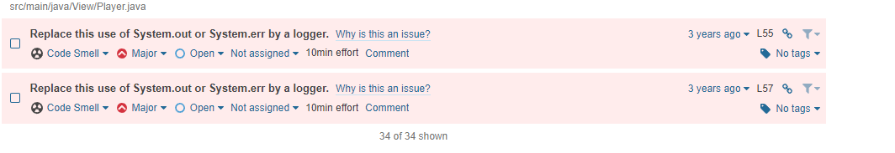

# Análisis de la deuda de Arquitectura 🏭🏛

En esta oportunidad usaremos una herramienta llamada Designite, la cual nos ayudará a calcular algunas métricas 
importantes a la hora de visualizar la deuda de arquitectura (Arquitectural Smells). 

## Sobre la herramienta 🔨

Designite es una suite de herramientas orientadas a la reducción general de la deuda técnica en el software. 
Principalmente pensada para soluciones C#, actualmente con soporte para aplicaciones Java/Maven por medio del IDE
IntelliJ IDEA que hemos venido usando a lo largo de los procesos de análisis. 

Sitio Web : https://www.designite-tools.com/

Designite para Java : https://www.designite-tools.com/designitejava/


### Instalación  🔋

La instalación de la herramienta es simple, basta con buscar el plugin para IntelliJIDEA directamente en el marketplace 
del IDE y dar click en instalar. 



### Registrar el análisis del proyecto 🧑‍🔬

Bastará con dirigirse al panel de herramientas, buscar la categoria de DesigniteJava y realizar el análisis del proyecto. 



Esta acción desencadenará el proceso de análisis en segundo plano, se recomienda esperar entre 5-10 minutos a que todas 
las dependencias se hayan actualizado para el proyecto. Terminado esto, en la parte inferior derecha (Layout estándar)
aparecerá el simbolo de DesigniteJava  y al hacer clic en el, se mostrará en pantalla el análisis del 
archivo actual en el contexto del IDE. 

### Métricas en consideración 🌡

Algunas de las métricas que vamos a considerar en esta oportunidad serán: 

|             Métrica             | Abreviación |                                               Explicación                                                |
|:-------------------------------:|:-----------:|:--------------------------------------------------------------------------------------------------------:|
|          Lines Of Code          |     LOC     |                            Cantidad de líneas de código fuente del artefacto                             | 
| Lack of cohesion of methods     |    LCOM     |                         Falta de cohesión en los métodos en % (escala de 0 - 1)                          |
|   Weighted methods per class    |     WMC     |                              Suma de la complejidad cyclomática de la clase                              |
|             Fan-In              |     FIN     |                    Dependencia de uso de la clase (Cuantas clases usan la definición)                    |
|             Fan-Out             |    FOUT     |              Dependencias propias de la clase (Cuantas definiciones externas usa la clase)               |
|    Depth of inheritance Tree    |     DIT     | Profundidad en el árbol de herencia (permite detectar delegación de comportamientos de alta profundidad) |

### Resultados 📈

Resultados Globales para las clases para las métricas expuestas: 



## Hallazgos Generales 🔎

- Vemos que las clases JDBCConnector y Song son críticas para la solución juzgando por sus métricas de Fade-In. 


- Otro punto notable es que la clase JDBCConnector sea crítica y su complejidad ciclomática general WMC sea de 42, lo que implica que se debe trabajar en esta abstracción y podemos estar evidenciando un anti-patrón de clase Dios/Demasiada responsabilidad. 


- Tenemos clases con complejidades grandes por fuera del JDBCConnector, cómo el PlayerController, MP3Player y Song, sus WMC son muy superiores a la media y deben ser evaluados, trayendo un análisis anterior en mención estás clases concentran gran cantidad de los [code-smells](https://github.com/sc-martinez/Player/blob/master/Code-Smells.md), por lo que podemos decir que las tareas de mejora futuras (Sprints de remediación) deben estar focalizadas en ellas. 
    
    
- En general no vemos clases con falta de cohesión. exceptuando SongBuilder, que debería verificarse la posibilidad de reemplazar la clase cómo parte de las carácteristicas propias de Song. 


- La clase Player se muestra bajamente cohesiva, pero se ve cómo una falsa alarma por ser el punto de entrada de GUI de la solución (Debe revisarse). 


- Se ve la presencia de muchos Magic Numbersa lo largo de la implementación, lo que hace pensar en la necesidad de abstraer una clase de configuración con estos atributos generalmente gráficos o de frecuencia. 


- Se había mencionado anteriormente en la introducción de herramientas, se reitera la necesidad de añadir un mecanismo de tratamiento de errores cómo un Logger para la solución, en este caso desde las perspectiva del Logger cómo componente. 

    

## Hallazgos específicos 🔎

### Clase - PlayerController, Clase - Song 

Se detecta un smell de arquitectura relacionado con la falta de modularización, la clase en general a pesar de tener buena cohesión, tiene demasiados métodos expuestos con un total de 31.

#### Plan de acción:

Verificar la posibilidad de fragmentar está clase en 2 o más sub clases que sirvan propósitos más específicos. 

### Clase - Genres, Class - Moods

Se detecta un smell relacionado con encapsulación pobre, pues la única propiedad que tiene (genres/ Moods) se encuentra expuesta públicamente.

#### Plan de acción

Al tratarse de una clase de configuración en donde lo importante es su valor en runtime, se puede corregir el encapsulamiento pobre con patrones de configuración bien conocidos cómo Singleton o facade. 

### Clase JDBC-Connector

Se encuentra un smell relacionado con una dependencia cíclica fuerte con la Clase Song, adicionalmente se encuentra que uno de los métodos addSongs, tiene una complejidad ciclomatica alta con un total de 18. 

La complejidad ciclomática de esta clase es muy alta con un total de 42. 
#### Plan de acción

Reducir la complejidad ciclomática del método dividiendolo en métodos auxiliares. 

También se recomienda utilizar estructuras de datos cómo diccionarios en esta sección.

```java
                    album = id3v2Tag.getAlbum();
                    if (id3v2Tag.getGenre() != -1) {
                        System.out.println("genres");
                        String genre = "";
                        switch (id3v2Tag.getGenre()) {
                            case 0:
                                genre = "blues";
                                break;
                            case 1:
                                genre = "classic rock";
                                break;
                            case 2:
                                genre = "country";
                                break;
                            case 9:
                                genre = "metal";
                                break;
                            case 13:
                                genre = "pop";
                                break;
                            case 14:
                                genre = "R&B";
                                break;
                            case 15:
                                genre = "rap";
                                break;
                            case 17:
                                genre = "rock";
                                break;
                            case 24:
                                genre = "soundtrack";
                                break;
                            case 32:
                                genre = "classical";
                                break;
                            case 20:
                                genre = "alternative";
                                break;

                        }
```

Está clase es un candidato para la aplicación de técnicas de refactorización y reingeniería para simplificar sus puntos de decisión. 

