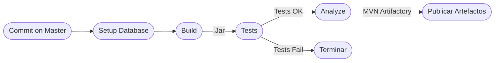

# Implementación de un proceso de CI 🔄

En esta sección se explicará la implementación del flujo de integración continua para la solución del reproductor de música. 

En esta oportunidad extenderemos un poco el uso de las GitHubActions y complementaremos el pipeline de desarrollo de la fase anterior [Introduciendo Herramientas en el proceso](https://github.com/sc-martinez/Player/blob/master/IntroducingToolsOnTheProcess.md).

### *CI Job YML*
<details><summary>Detalle del Job</summary>
<p>

#### Encontrado en test/Model/Model.YoutubeLauncherTest.java

```yml

```
</details></p>

Este **Job** interceptará todas las operaciones de _**commit**_ en el repositorio de código fuente, ejecutará las diferentes fases del pipeline de CI. 

## Flujo de integración continua 🔃

Dividiremos nuestras fases del proceso de CI en los siguientes flujos: 

### Flujo de construcción y artefactos

### Flujo de Release y comunicaciones


## Alcance y Fases del flujo

### Build 🧱
Paso encargado de construir el artefacto Jar sin dependencias, encargado de verificar si el proyecto se encuentra en un buen estado estructural

```yml
  - name: Build
        run:
          sudo apt-get install xvfb &&
          Xvfb :99 &>/dev/null & export DISPLAY=":99" && mvn compile 
```

### Test ✅

Paso encargado de ejecutar las pruebas unitarias sobre el artefacto, verificando su integridad funcional. 

Las pruebas unitarias, al contener componentes de prueba de UI deberán ser ejecutadas en modo headless para verificar el comportamiento de los componentes de JavaFX.

```yml
- name : Tests
    run:
      sudo apt-get install xvfb &&
      Xvfb :99 &>/dev/null & export DISPLAY=":99" && mvn test
```

### Analyze  ⏱

Paso encargado de realizar el análisis estático de código, de este paso se habló extensivamente en la fase [Introduciendo Herramientas en el proceso](https://github.com/sc-martinez/Player/blob/master/IntroducingToolsOnTheProcess.md).

```yml
- name: Verify
  env:
  GITHUB_TOKEN: ${{ secrets.GITHUB_TOKEN }}  # Needed to get PR information, if any
  SONAR_TOKEN: ${{ secrets.SONAR_TOKEN }}
  run:
  sudo apt-get install xvfb &&
  Xvfb :99 &>/dev/null & export DISPLAY=":99" &&
  mvn clean install -B verify org.sonarsource.scanner.maven:sonar-maven-plugin:sonar -Dsonar.projectKey=sc-martinez_Player
```

## Publicación de artefactos 🎁

Paso encargado de construir el Jar final de la versión de la solución, este es un Jar ejecutable que contiene todas las dependencias necesarias para la solución. 

### Modificaciones en Pom.xml
La fase de empaquetado de esta solución, se modificó para proveer un sólo Jar con todas las dependencias incluidas, este artefacto servirá cómo ejecutable para usuario final de nuestra solución. 
```xml
        <plugin>
                <groupId>org.apache.maven.plugins</groupId>
                <artifactId>maven-assembly-plugin</artifactId>
                <version>2.2-beta-5</version>
                <executions>
                    <execution>
                        <phase>package</phase>
                        <goals>
                            <goal>single</goal>
                        </goals>
                        <configuration>
                            <archive>
                                <manifest>
                                    <mainClass>
                                        View.Launcher
                                    </mainClass>
                                </manifest>
                            </archive>
                            <descriptorRefs>
                                <descriptorRef>jar-with-dependencies</descriptorRef>
                            </descriptorRefs>
                        </configuration>
                    </execution>
                </executions>
        </plugin>
```
### Step #1
```yml
  - name : Package
      run : sudo apt-get install xvfb &&
        Xvfb :99 &>/dev/null & export DISPLAY=":99" &&
        mvn package
```

### Step #2
```yml
      - name: Publish executable to Artifactory
        uses: actions/upload-artifact@v3
        with:
          name: version-executable
          path: target/Player-1.0.1-jar-with-dependencies.jar
```

   
## Creación automática de Releases 🚀


## Integración con herramientas de comunicación - Email 📤


