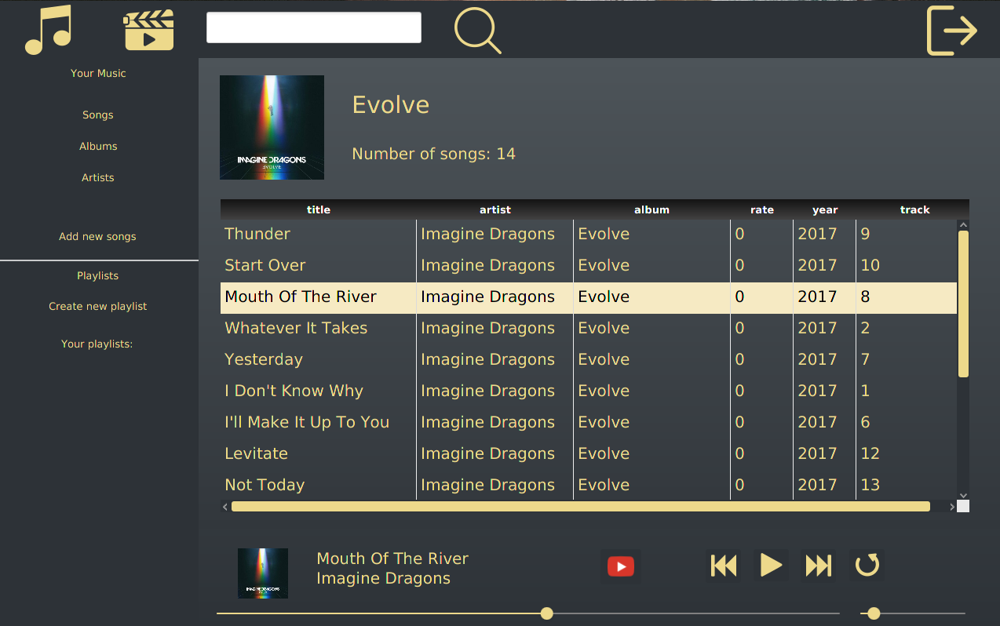
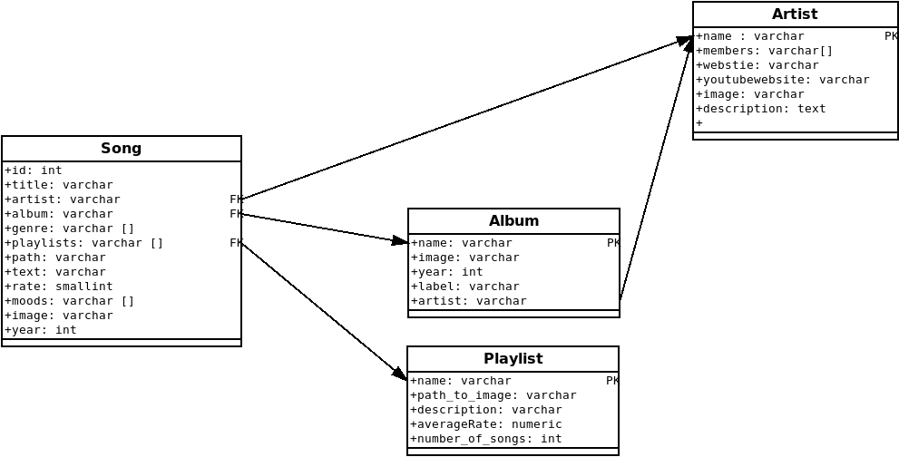
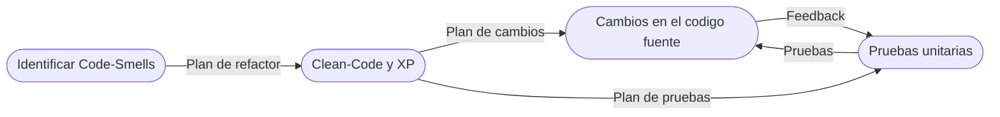

## Recuperando del reproductor de Audio : Un proyecto de Gestión de la deuda técnica - CSDT

## _Métricas de calidad_

### Últimos resultados: 

### Calificación por atributos no funcionales: 

## Resumen
Este repositorio contiene el resultado de la aplicación de técnicas de gestión de la deuda técnica a un proyecto publico de código legado cómo caso de estudio.

En esta oportunidad se hará el análisis, gestión y resolución de la deuda técnica a una solución de reproducción de audio construida por un estudiante de ciencias de la computación.

###Objetivo
Se identificarán las oportunidades de mejora y se implementarán los cambios necesarios en el repositorío relacionado cómo Fork.

 Original :  https://github.com/DanielVeB/Player

 Fork :  https://github.com/sc-martinez/Player

## Detalles técnicos del proyecto

El reproductor de audio utiliza el siguiente stack de tecnología :
   - [Java 16+](https://www.oracle.com/java/technologies/javase/jdk16-archive-downloads.html)   
   - [JavaFX 17](https://openjfx.io/) 
   - [Maven](https://maven.apache.org/) 
   - [PostgresSQL](https://www.postgresql.org/)
   - [CSS](https://developer.mozilla.org/es/docs/Web/CSS)
   - [Docker](https://www.google.com/search?q=docker&oq=docker&aqs=chrome..69i57j69i59j0i271j69i60j69i65l3j69i60.1913j0j7&sourceid=chrome&ie=UTF-8)

## Features
   - Reproducir musica en formato MP3
   - Clasificación de canciones por género o estado de ánimo (Mood)
   - Búsqueda de canciones por álbum, artista o nombre
   - Búsqueda de letras de las canciones en [Azlyrics](https://www.azlyrics.com/)
   - la capacidad de conectarse automáticamente a YouTube y mostrar la canción allí

## Muestra de UI

## Documentación de la solución
Modelo entidad-relación MER (Original) : 
  

## Instalación
**Nota de desarrollo**: Pendiente por documentar, hace parte de la deuda-técnica en este punto

- [ ] Ejecutar una instancia local de postgresSQL - Docker
         
      cd dockerYamls/PostgreSQL
      docker-compose up 

- [ ] Crear la Base de datos player <En construcción SQL de migración>    
- [ ] Ejecutar View/Player con Java SDK 11 con los siguientes parametros de JVM

      --module-path="<mypath>\Java\javafx-sdk-17.0.2\lib" --add-modules=javafx.controls,javafx.fxml 

## Flujo de trabajo
El trabajo se dividirá siguiendo el siguiente flujo de actividades.

## Bitácora
- ***22- 24 de febrero de 2022***  : Instalación y documentación inicial de la solución, fundación de este repositorio.
  - Resultados en : [README](https://github.com/sc-martinez/Player/blob/master/README.md)
- ***25-26 de febrero de 2022***  : Identificación de Code-Smells
  - Resultados en : [Code-Smells](https://github.com/sc-martinez/Player/blob/master/Code-Smells.md)

- ***05-06 de marzo de 2022***  : Valoración de características de Clean Code y prácticas XP
  
  - Resultados en : [CleanCode-XP-Assessment.md]( https://github.com/sc-martinez/Player/blob/master/CleanCode-XP-Assessment.md )

- ***09-13 de marzo de 2022***  : Creación de pruebas de unidad, análisis de deuda técnica de pruebas. 
  - Resultados en : [TechnicalDebt -Model.Tests.md](https://github.com/sc-martinez/Player/blob/master/TechnicalDebt%20-Tests.md)

- ***18-20 de marzo de 2022***  : Utilización de herramientas de anális estático de código.
  - Resultados en : [IntroducingToolsOnTheProcess.md](https://github.com/sc-martinez/Player/blob/master/IntroducingToolsOnTheProcess.md)

- ***25-27 de marzo de 2022***  : Introducción de pipelines de CI (Continuous integrations).
  - Resultados en : [IntroducingCI.md](https://github.com/sc-martinez/Player/blob/master/IntroducingCI.md)

- ***01-03 de Abril de 2022***  : Análisis de deuda de arquitectura.
  - Resultados en : [ArchitecturalDebt.md](https://github.com/sc-martinez/Player/blob/master/ArchitecturalDebt.md)
