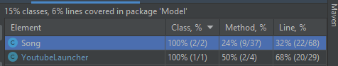
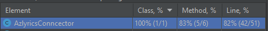
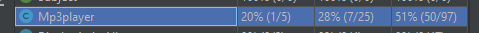

# Valoración de prácticas de Testing Debt  🧪

En el proyecto actual no se encuentra evidencia de aplicación de prácticas de pruebas automatizadas.

Por lo tanto se propone realizar la implementación de pruebas de unidad para algunas secciones críticas del código fuente, se dividirán los esfuerzos de pruebas en 3 grandes grupos : 

### Grupos

|   Grupo    |       Clase        |   
|:----------:|:------------------:|
| Controller | EditArtistOrAlbum  |
| Controller | editSongController |
| Controller |  PlayerController  |
|    View    |       Player       |
|   Model    |       Album        |
|   Model    |       Artist       |
|   Model    | editSongController |
|   Model    |     MP3Player      |
|   Model    |  AzlyricsConncector   |
|   Model    |  YoutubeLauncher   |

### *Bítacora de implementación de pruebas de unidad* ✔️

### *YoutubeLauncher*
<details><summary>Prueba de unidad</summary>
<p>

#### Encontrado en test/Model/Model.YoutubeLauncherTest.java
```java

import Model.Song;
import Model.YoutubeLauncher;
import org.junit.Test;

import static org.junit.Assert.*;

public class Model.YoutubeLauncherTest {

    @Test
    public void findYoutubeLinkWhenSongExists() {
        //Arrange
        Song s = new Song
                .SongBuilder("")
                .album("meteora")
                .artist("Linkin Park")
                .title("In The End")
                .build();
        YoutubeLauncher yb = new YoutubeLauncher(s);
        //Act
        String result = yb.findYoutubeLink();
        //Assert
        assertNotNull(result);
    }

    @Test
    public void findYoutubeLinkWhenSongNotExists() {
        //Arrange
        Song s = new Song
                .SongBuilder("")
                .album("unknown")
                .artist("unknown")
                .title("1231asdazsdasdasd12w112312312312@!@##")
                .build();
        YoutubeLauncher yb = new YoutubeLauncher(s);
        //Act
        String result = yb.findYoutubeLink();
        //Assert
        assertNull(result);
    }


}
```

</details></p>

#### Coverage




### *AzlyricsConncector*
<details><summary>Prueba de unidad</summary>
<p>

#### Encontrado en test/Model/AzlyricsConncectortest.java
```java
import Model.AzlyricsConncector;
import org.junit.Test;

import static org.junit.Assert.*;

public class Model.AzlyricsConncectorTest {

    @Test
    public void returnLyricsWhenSongExists() {
        //Arrange
        AzlyricsConncector connector = new AzlyricsConncector("linkinpark", "In The End");
        //Act
        connector.run();
        //Assert
        assertNotNull(connector.returnLyrics());
    }

    @Test
    public void returnLyricsWhenSongNoExists() {
        //Arrange
        AzlyricsConncector connector = new AzlyricsConncector("linkinpark", "123123asdasfasdfasd");
        //Act
        connector.run();
        //Assert
        assertNull(connector.returnLyrics());
    }

}
```

</details></p>





### *Mp3player*
<details><summary>Prueba de unidad</summary>
<p>

#### Encontrado en test/Model/Mp3playerTest.java
```java

package Model;

import javafx.application.Platform;
import javafx.scene.Scene;
import javafx.scene.layout.AnchorPane;
import javafx.stage.Stage;
import org.testfx.assertions.api.Assertions;
import org.testfx.framework.junit.ApplicationTest;

import org.junit.Test;

import java.util.ArrayList;
import java.util.Arrays;
import java.util.LinkedList;
import java.util.List;

import static org.junit.Assert.*;

public class Mp3playerTest extends ApplicationTest {

    AnchorPane pane;

    @Override
    public void start(Stage stage) {
        pane = new AnchorPane();
        stage.setScene(new Scene( pane
                , 100, 100));
        stage.show();
    }

    @Test
    public void loadSongs() {
        Song sa = new Song
                .SongBuilder("")
                .album("meteora")
                .artist("Linkin Park")
                .title("Breaking The Habit")
                .build();
        Song sb = new Song
                .SongBuilder("")
                .album("meteora")
                .artist("Linkin Park")
                .title("Numb")
                .build();
        LinkedList<Song> songs = new LinkedList<Song>(List.of(new Song[]{sa, sb}));
        Mp3player mp3 = new Mp3player();
        Platform.runLater( new Thread(()-> {
            mp3.loadBar(pane);
            mp3.loadSongs(songs);
            //Throws exception due that file extension does not exists, but the song is queued into the player
            assertThrows(NullPointerException.class, ()-> { mp3.setCurrentSong(0); });
        }));
    }


    @Test
    public void next() {
        Song sa = new Song
                .SongBuilder("")
                .album("meteora")
                .artist("Linkin Park")
                .title("Breaking The Habit")
                .build();
        LinkedList<Song> songs = new LinkedList<Song>(List.of(new Song[]{sa}));
        Mp3player mp3 = new Mp3player();
        Platform.runLater( new Thread(()-> {
            mp3.loadBar(pane);
            mp3.loadSongs(songs);
            //Throws exception due that file extension does not exists, but the song is queued into the player
            assertThrows(NullPointerException.class, ()-> { mp3.next(); });
        }));

    }

    @Test
    public void prev() {
        Song sa = new Song
                .SongBuilder("")
                .album("meteora")
                .artist("Linkin Park")
                .title("Breaking The Habit")
                .build();
        LinkedList<Song> songs = new LinkedList<Song>(List.of(new Song[]{sa}));
        Mp3player mp3 = new Mp3player();
        Platform.runLater( new Thread(()-> {
            mp3.loadBar(pane);
            mp3.loadSongs(songs);
            //Throws exception due that file extension does not exists, but the song is queued into the player
            assertThrows(NullPointerException.class, ()-> { mp3.prev(); });
        }));
    }

    @Test
    public void setAutoreplay() {
        Song sa = new Song
                .SongBuilder("")
                .album("meteora")
                .artist("Linkin Park")
                .title("Breaking The Habit")
                .build();
        Mp3player mp3 = new Mp3player();
        Platform.runLater( new Thread(()-> {
            mp3.loadBar(pane);
            //Throws exception due that file extension does not exists, but the song is queued into the player
            assertTrue(mp3.setAutoreplay());
            assertFalse(mp3.setAutoreplay());
        }));
    }
}
```

</details></p>



## Hallazgos 🔎

El proyecto tiene una dependencia fuerte con los componentes de JavaFx. 

Estos al ser componentes de UI utilizan multi-threading para la mayoría de sus invocaciones, en este caso para generar pruebas en componentes de FX se utiliza la suite de pruebas de unidad TestFX.

La cual permite crear entornos virtuales de pruebas para componentes FX, lo que habilita las pruebas de las unidades de negocio y middle-ware de la aplicación. 
###Repositorio de la suite de pruebas 

- [FX Tests](https://github.com/TestFX/TestFX)


## Propuestas 
