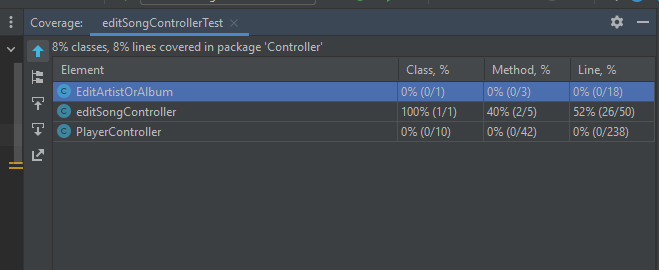
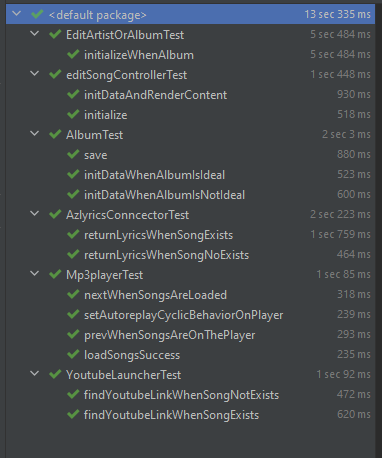
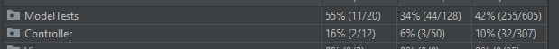
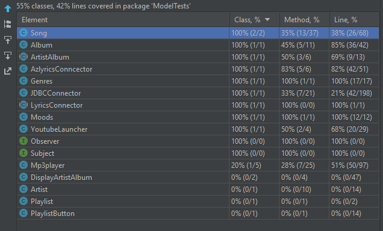

# Valoración de prácticas de Testing Debt  🧪

En el proyecto actual no se encuentra evidencia de aplicación de prácticas de pruebas automatizadas.

Por lo tanto se propone realizar la implementación de pruebas de unidad para algunas secciones críticas del código fuente, se dividirán los esfuerzos de pruebas en 3 grandes grupos : 

### Grupos

|   Grupo    |       Clase        |   
|:----------:|:------------------:|
| Controller | EditArtistOrAlbum  |
| Controller | editSongController |
| Controller |  PlayerController  |
|   Model    |       Album        |
|   Model    |       Artist       |
|   Model    | editSongController |
|   Model    |     MP3Player      |
|   Model    |  AzlyricsConncector   |
|   Model    |  YoutubeLauncher   |

Se identifican algunas clases que no son Testeables, por su alto acoplamiento con 
los componentes gráficos de JavaFX y no uso funcion al en la aplicación.


|   Grupo    |       Clase        |                                        Justificación                                        |
|:----------:|:------------------:|:-------------------------------------------------------------------------------------------:|
|    View    |       Player       |                    Punto de entrada principal, alto acoplamiento con JFX                    |
| Controller |  PlayerController  |                      Controlador principal, alto acoplamiento con JFX                       |
|   Model    | DisplayArtistAlbum |                              Clase abstracta, probada en Album                              |
|   Model    |       Artist       |                   No soportado actualmente  según documentación original                    |
|   Model    |      PlayList      | No soportado actualmente  según documentación original, parte de trabajo pendiente (Futuro) |
|   Model    |   PlayListButton   |                   No soportado actualmente  según documentación original  , parte de trabajo pendiente (Futuro)                  |


### *Bítacora de implementación de pruebas de unidad* ✔️
A continuación se presenta un resumen de las pruebas unitarias más destacables de toda la implementación de la suite. 
###Ejemplos
### *YoutubeLauncher*
<details><summary>Prueba de unidad</summary>
<p>

#### Encontrado en test/Model/Model.YoutubeLauncherTest.java

```java

import org.junit.Test;

public class Model.YoutubeLauncherTest{

@Test
public void findYoutubeLinkWhenSongExists(){
        //Arrange
        Song s=new Song
        .SongBuilder("")
        .album("meteora")
        .artist("Linkin Park")
        .title("In The End")
        .build();
        YoutubeLauncher yb=new YoutubeLauncher(s);
        //Act
        String result=yb.findYoutubeLink();
        //Assert
        assertNotNull(result);
        }

@Test
public void findYoutubeLinkWhenSongNotExists(){
        //Arrange
        Song s=new Song
        .SongBuilder("")
        .album("unknown")
        .artist("unknown")
        .title("1231asdazsdasdasd12w112312312312@!@##")
        .build();
        YoutubeLauncher yb=new YoutubeLauncher(s);
        //Act
        String result=yb.findYoutubeLink();
        //Assert
        assertNull(result);
        }


        }
```

</details></p>

#### Coverage


### *AzlyricsConncector*
<details><summary>Prueba de unidad</summary>
<p>

#### Encontrado en test/Model/AzlyricsConncectortest.java

```java

import org.junit.Test;

import static org.junit.Assert.*;

public class Model.AzlyricsConncectorTest{

@Test
public void returnLyricsWhenSongExists(){
        //Arrange
        AzlyricsConncector connector=new AzlyricsConncector("linkinpark","In The End");
        //Act
        connector.run();
        //Assert
        assertNotNull(connector.returnLyrics());
        }

@Test
public void returnLyricsWhenSongNoExists(){
        //Arrange
        AzlyricsConncector connector=new AzlyricsConncector("linkinpark","123123asdasfasdfasd");
        //Act
        connector.run();
        //Assert
        assertNull(connector.returnLyrics());
        }

        }
```

</details></p>


### *Mp3player*
<details><summary>Prueba de unidad</summary>
<p>

#### Encontrado en test/Model/Mp3playerTest.java

```java

package ModelTests;

import javafx.application.Platform;
import javafx.scene.Scene;
import javafx.scene.layout.AnchorPane;
import javafx.stage.Stage;
import org.testfx.assertions.api.Assertions;
import org.testfx.framework.junit.ApplicationTest;

import org.junit.Test;

import java.util.LinkedList;
import java.util.List;

import static org.junit.Assert.*;

public class Mp3playerTest extends ApplicationTest {

    AnchorPane pane;

    @Override
    public void start(Stage stage) {
        pane = new AnchorPane();
        stage.setScene(new Scene(pane
                , 100, 100));
        stage.show();
    }

    @Test
    public void loadSongs() {
        Song sa = new Song
                .SongBuilder("")
                .album("meteora")
                .artist("Linkin Park")
                .title("Breaking The Habit")
                .build();
        Song sb = new Song
                .SongBuilder("")
                .album("meteora")
                .artist("Linkin Park")
                .title("Numb")
                .build();
        LinkedList<Song> songs = new LinkedList<Song>(List.of(new Song[]{sa, sb}));
        Mp3player mp3 = new Mp3player();
        Platform.runLater(new Thread(() -> {
            mp3.loadBar(pane);
            mp3.loadSongs(songs);
            //Throws exception due that file extension does not exists, but the song is queued into the player
            assertThrows(NullPointerException.class, () -> {
                mp3.setCurrentSong(0);
            });
        }));
    }


    @Test
    public void next() {
        Song sa = new Song
                .SongBuilder("")
                .album("meteora")
                .artist("Linkin Park")
                .title("Breaking The Habit")
                .build();
        LinkedList<Song> songs = new LinkedList<Song>(List.of(new Song[]{sa}));
        Mp3player mp3 = new Mp3player();
        Platform.runLater(new Thread(() -> {
            mp3.loadBar(pane);
            mp3.loadSongs(songs);
            //Throws exception due that file extension does not exists, but the song is queued into the player
            assertThrows(NullPointerException.class, () -> {
                mp3.next();
            });
        }));

    }

    @Test
    public void prev() {
        Song sa = new Song
                .SongBuilder("")
                .album("meteora")
                .artist("Linkin Park")
                .title("Breaking The Habit")
                .build();
        LinkedList<Song> songs = new LinkedList<Song>(List.of(new Song[]{sa}));
        Mp3player mp3 = new Mp3player();
        Platform.runLater(new Thread(() -> {
            mp3.loadBar(pane);
            mp3.loadSongs(songs);
            //Throws exception due that file extension does not exists, but the song is queued into the player
            assertThrows(NullPointerException.class, () -> {
                mp3.prev();
            });
        }));
    }

    @Test
    public void setAutoreplay() {
        Song sa = new Song
                .SongBuilder("")
                .album("meteora")
                .artist("Linkin Park")
                .title("Breaking The Habit")
                .build();
        Mp3player mp3 = new Mp3player();
        Platform.runLater(new Thread(() -> {
            mp3.loadBar(pane);
            //Throws exception due that file extension does not exists, but the song is queued into the player
            assertTrue(mp3.setAutoreplay());
            assertFalse(mp3.setAutoreplay());
        }));
    }
}
```

</details></p>


### *editSongController*
<details><summary>Prueba de unidad</summary>
<p>

#### Encontrado en test/Model/editSongControllerTest.java

```java
package Controller;

import ModelTests.JDBCConnector;
import ModelTests.Song;
import javafx.application.Platform;
import javafx.fxml.FXMLLoader;
import javafx.scene.Scene;
import javafx.scene.layout.Pane;
import javafx.stage.Stage;
import org.junit.Test;
import org.testfx.framework.junit.ApplicationTest;

import java.io.IOException;
import java.sql.SQLException;
import java.util.ArrayList;
import java.util.List;
import java.util.UUID;

import static org.junit.Assert.*;

public class editSongControllerTest extends ApplicationTest {

    FXMLLoader loader;
    String artist = UUID.randomUUID().toString() ;
    String song = UUID.randomUUID().toString() ;
    List<Song> songs = new ArrayList<>();

    @Override
    public void start(Stage stage) throws IllegalAccessException, InstantiationException, SQLException, ClassNotFoundException, IOException {
        loader= new FXMLLoader(
                getClass().getResource(
                        "/editSong.fxml"
                )
        );
        stage.setScene(new Scene((Pane) loader.load()));
        stage.show();
        Song sa = new Song
                .SongBuilder("")
                .album("meteora")
                .artist(artist)
                .title(song)
                .build();
        songs.add(sa);
        JDBCConnector.connect();
        JDBCConnector.addArtist(artist);

    }


    @Test
    public void initDataAndRenderContent() {
        Platform.runLater( new Thread(()-> {
            editSongController controller = loader.getController();
            controller.initData(songs.get(0));
            assertEquals(songs.get(0).getArtist(), artist);
        }));
    }

    @Test
    public void initialize() {
        Platform.runLater( new Thread(()-> {
            editSongController controller = loader.getController();
            controller.initialize(null, null);
            assertEquals(songs.get(0).getArtist(), artist);
        }));
    }
}
```

</details></p>



### Resumen de pruebas ejecutadas
En total se implementaron 6 clases de pruebas de unidad cubriendo un total de 14 escenarios críticos para el funcionamiento del reproductor. 
Se prueban integraciones externas con servicios de reproducción de videos de Youtube y obtención de letras de canciones por medio de AZLyrics.com



### Resumen acumulado de Coverage de la suite implementada

Se logra cubrir un total del 55% de las clases, con una cobertura general del 42% de la funcionalidad de la aplicación, se excluyen modelos no utilizados y aquellos que se dedican exclusivamente a actividades de persistencia JDBC.

Se cubre un 10% a nivel de controlador, esto debido al fuerte acomplamiento con librerias de JFX que impiden probar las clases de forma programatica. 



### Cobertura del Paquete de modelos

En lógica de negocio se logra cubrir un 42% de cobertura total, se ven oportunidades de pruebas en las clases Song y MP3Player.



## Hallazgos 🔎

El proyecto tiene una dependencia fuerte con los componentes de JavaFx. 


Estos al ser componentes de UI utilizan multi-threading para la mayoría de sus invocaciones, en este caso para generar pruebas en componentes de FX se utiliza la suite de pruebas de unidad TestFX la cual permite crear entornos virtuales de pruebas para componentes FX, lo que habilita las pruebas de las unidades de negocio y middle-ware de la aplicación. 

### Repositorio de la suite de pruebas 

- [FX Tests](https://github.com/TestFX/TestFX)


## Propuestas 
En contraposición a la libreria de JafaFx, se recomienda, para mantener el producto en el tiempo, incluir una secuencia de pasos de pruebas funcionales que complementen estas pruebas de unidad.

### Algunas limitaciones

JavaFx sólo puede verificar la composición de interfaces gráficas a nivel estructural, a nivel de orquestación de eventos, pero palidece a la hora de hacer una verificación de UX y emular alguos escenarios que sólo pueden ser verificados vía pruebas funcionales cómo por ejemplo : La reproducción de audio de la canción seleccionada, la funcionalidad de repetición del autoreplay, el comportamiento circular de la lista de reproducción .

### Trabajo futuro 

Otro punto focal de la aplicación está en el JDBCConnector, para realizar pruebas de esta clase será necesario emular el ambiente de persistencia de la aplicación.
Para ello se implementará el uso de Mocks de JDBC con Mockito, esto permitirá simular ambientes de persistencia y mocks de objectos DAOs de forma simple. 

[Mockito Project](https://site.mockito.org/)

### Recomendaciones finales

Se recomienda con alta prioridad, desacoplar el concepto de modelo de las interfaces Gráficas AnchorPane, esto permitirá reproducir mas funcionalidades de forma programatica y mejorara la testeabilidad general del producto de software. 
